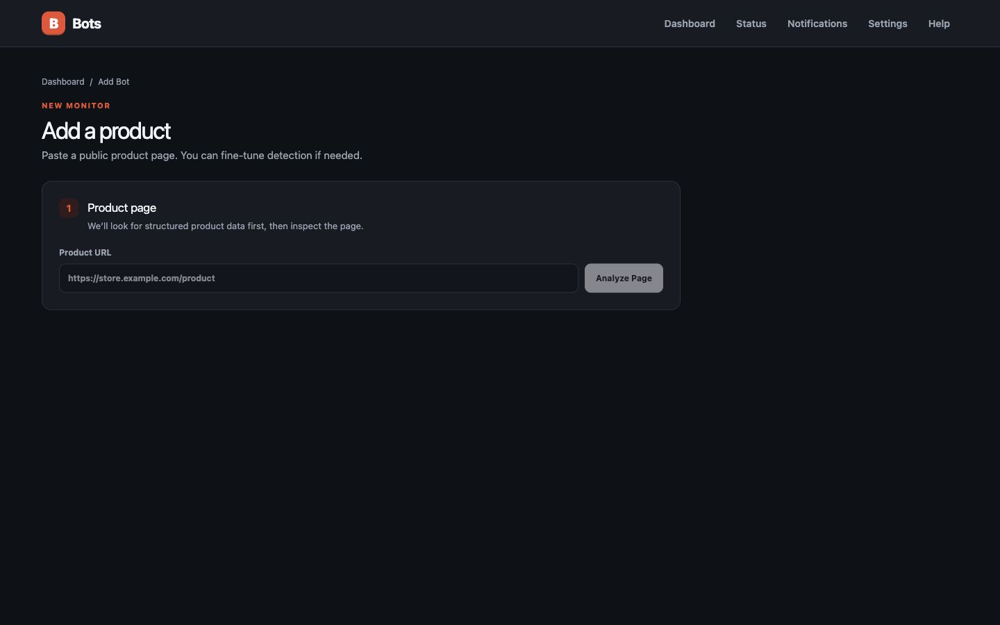

# Bots

Bots is a private, self-hosted product, website, and server monitor designed for Unraid. It watches prices, availability, uptime, response time, DNS, and TLS certificates, keeps history, and alerts you when a meaningful confirmed change occurs.

## Screenshots



## Features

- JSON-LD, Open Graph/meta, common-selector, visible-text, CSS-selector, and optional Chromium detection
- Price/availability history with two-result confirmation to reduce false positives
- HTTP and TCP uptime checks with latency graphs, outage confirmation, recovery alerts, DNS change detection, and TLS-expiry warnings
- Price drop, target price, back-in-stock, out-of-stock, price-increase, failure, and recovery events
- Discord, Gotify, Pushover, Telegram, SMTP configuration, and generic webhook channels
- Encrypted notification secrets, SSRF protection, public-address DNS validation, redirect revalidation, timeouts, and response-size limits
- One SQLite database; all durable state lives under `/data`
- Separate scheduler process with database locking and bounded concurrency
- Responsive light/dark interface designed for Unraid WebUI
- Interactive price-history charts with target lines and date filters
- Bot health diagnostics, confirmation status, warnings, and delivery activity
- Dashboard search, status filters, sorting, selection, and bulk controls
- Historical-low and product/variant-change alerts with notification cooldowns
- Variant labels and CSS-based variant value tracking
- Per-bot notification channel assignment and test-alert delivery

## Unraid installation

Download `unraid/bots.xml` from this repository and copy it to `/boot/config/plugins/dockerMan/templates-user/my-bots.xml`. In Unraid, choose **Docker → Add Container → Bots**. The template pulls `ghcr.io/dotumzane/bots:latest`, maps `/data` to `/mnt/user/appdata/bots`, and exposes the WebUI on port `3847`.

## Docker Compose

```bash
docker compose up --build -d
```

Open `http://localhost:3847`. Configuration and the SQLite database are stored in `./data`.

## Notification setup

Open **Notifications**, choose a provider, enter its credentials, save, and use **Test**. Secrets are AES-256-GCM encrypted using a key generated at `/data/encryption.key`. Back up that key with the database.

## Website compatibility and limitations

Bots works best on public product pages with Schema.org Product data. Some websites block automated clients, require authentication, use CAPTCHAs, or render data in unusual ways. Bots does not bypass those controls. JavaScript-rendered pages may need browser mode; ambiguous pages may need manual CSS selectors. Respect site terms and choose conservative intervals.

## Security design

Only HTTP(S) URLs are accepted. DNS is resolved before requests; loopback, private, link-local, carrier-grade NAT, multicast, and metadata hosts are rejected. Redirect destinations are rechecked. Responses, redirects, and execution times are bounded. Chromium runs in a separate process and no product HTML is rendered by the application UI. Provider secrets are never returned by APIs.

This is designed primarily for a trusted home network and does not currently include user authentication. Put it behind an authenticated reverse proxy before exposing it to the internet.

## Backup and restore

Stop the container and back up `/mnt/user/appdata/bots`, especially `bots.db` and `encryption.key`. The Settings page exports non-secret configuration as JSON. Restore both the database and key together.

## Development

Requires Node.js 20+.

```bash
cp .env.example .env
npm install
npx playwright install chromium
npm run prisma:generate
npm run prisma:migrate
npm run dev
```

Run the scheduler separately with `npm run worker`. Other commands: `npm run build`, `npm run start`, `npm test`, `npm run test:e2e`, `npm run lint`, and `npm run typecheck`.

### Publish the Unraid image from macOS

With Docker Desktop running and authenticated to GHCR:

```bash
npm run docker:publish
```

This builds `linux/amd64` locally and publishes `ghcr.io/dotumzane/bots:latest`. Normal Git pushes do not build containers; the GitHub Actions workflow is retained as a manual fallback.

## Architecture

Next.js App Router serves React pages and Zod-validated REST endpoints. Prisma owns SQLite. The detector fetches pages through the SSRF guard, parses static HTML first, and optionally falls back to Playwright. A separate worker claims due rows, runs bounded checks, confirms changes, persists states/events, and dispatches modular providers.

API routes include `/api/analyze`, CRUD under `/api/bots`, manual/pause/resume/history actions, notification-channel CRUD/testing, settings import/export, and `/api/health`.

## Troubleshooting

- **Database errors:** verify `/data` is writable and `DATABASE_URL=file:/data/bots.db`.
- **Chromium errors:** confirm the image includes Playwright Chromium and enough shared memory.
- **No detected price:** inspect the page’s structured data and add a price CSS selector.
- **Access blocked:** increase the interval or stop monitoring; Bots does not circumvent blocks.
- **Notifications fail:** test the channel and verify firewall/DNS access from the container.

## Community Applications submission

The submission-ready Unraid template is [`unraid/bots.xml`](unraid/bots.xml). It installs the public `linux/amd64` image from GHCR and persists all application state under `/data`.

Maintainer submission details and the final verification checklist are in [`unraid/COMMUNITY_APPS.md`](unraid/COMMUNITY_APPS.md).
